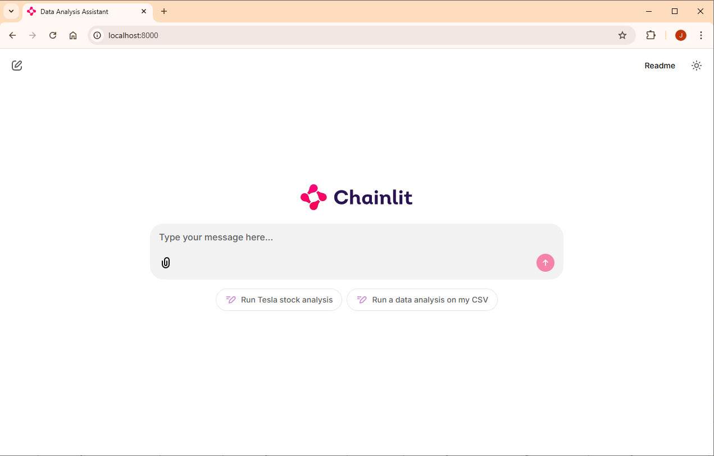
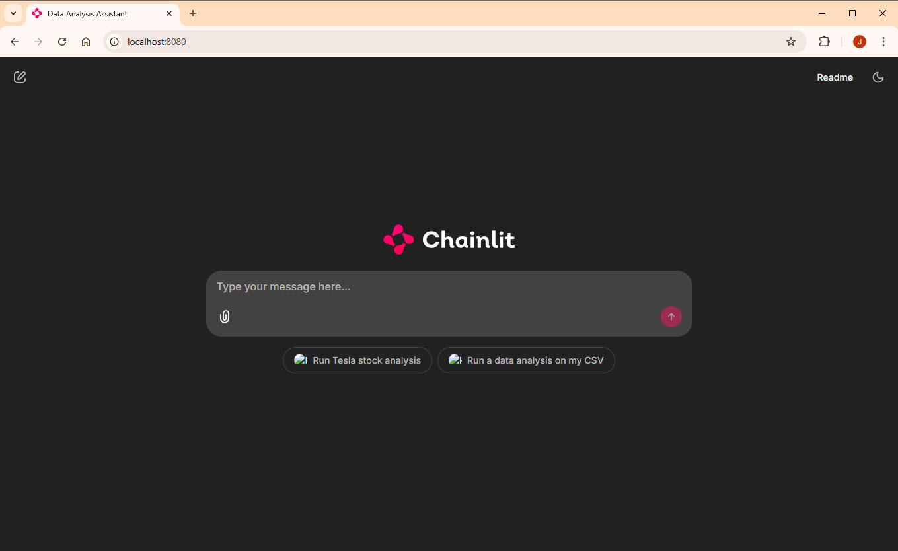

# Chainlit OpenAI AssistantsAPI Azure Container Apps Starter

The project includes the python application from the [Chainlit Cookbook repo's open-data-analyst directory](https://github.com/Chainlit/cookbook/tree/main/openai-data-analyst). Currently it uses OpenAI (not Azure Open AI).

This repository includes all the infrastructure and configuration necessary to provision Azure resources and deploy the Chainlit application to [Azure Container Apps](https://learn.microsoft.com/en-us/azure/container-apps/overview) using the [Azure Developer CLI](https://learn.microsoft.com/en-us/azure/developer/azure-developer-cli/overview?tabs=windows).

## Getting started

There are several ways to get started with this project.

## Prerequisites

You need to install the following tools to run locally on you machine:

* [Python 3.12](https://www.python.org/downloads/)
* [Azure Developer CLI](https://learn.microsoft.com/en-us/azure/developer/azure-developer-cli/install-azd?tabs=winget-windows%2Cbrew-mac%2Cscript-linux&pivots=os-windows)
* [Docker Desktop](https://www.docker.com/products/docker-desktop/)
* [Git](https://git-scm.com/downloads)
* Azure Subscription (Can signup for a [free account](https://azure.microsoft.com/en-us/pricing/purchase-options/azure-account?icid=azurefreeaccount) if you don't have one)
* An OpenAI account to create API Key and Assistant IDs
* Clone this repo to a local directory

## Deploying to Azure with azd

In the command line, navigate to the root of this repository.

1. Login to your Azure subscription using `azd`

```
azd auth login
```

2. Ensure Docker Desktop is running on you machine

3. Package, provision and deploy all the resources to azure

```
azd up
```

You will be asked for the following items:

* The Azure subscription to use
* The location to create the resources
* The OpenAI API Key to use
* The OpenAI Assistant Id to use

## Running in Local Environment

You can also run the Chainlit application locally on your machine or in a container.

### Using VS Code and a Python virtual environment

1. Open the project in your Visual Studio Code
2. Right click on the **src** folder and select **Open Integrated Terminal**
3. In the terminal run the following to create a virtual environment:
```python
python -m venv venv
```
4. Activate the environment
```python
.\venv\Scripts\activate
```
5. Install the requirements
```python
pip install -r requirements.txt
```
6. Create a new file in the **src** folder named **.env** and past the following contents in it:

```shell
OPENAI_API_KEY=
OPENAI_ASSISTANT_ID=
LITERAL_API_KEY=
```

7. If you don't already have an OpenAI API Key for the application, you will need to create one and add it to the **.env** file (TODO: add link to instructions to do this)
8. Also you will need an OpenAI Assistant Id, which you'll need to create if you don't have one. (TODO: add link to instructions to do this)
9. Run the Chainlit application to have it started locally
```python
chainlit run app.py -w
```
10. Open a browser and go to http://localhost:8000



### Using Docker

You'll need the following from Open AI

* API Key
* Assistants Id

1. On a command line where you cloned the repo run the following in the **src** directory (that is where the dockerfile is)
```shell
docker build -t chainlit-local .
```
2. Run the container passing in the OpenAI API Key and the Assistants Id (replace my values with yours):
```shell
docker run -d -p 8080:8080 -e OPENAI_API_KEY=sk-proj-VeCHX.... -e OPENAI_ASSISTANT_ID=asst_4Uk... chainlit-local
```
That will out put an id like:
OEuEVx4dQG2heE chainlit-localb5f26ab2cbeb5b42cb98d36ce545c0d39a6997c844cb85b2aba505e691888299

3. Open a browser and go to http://localhost:8080


